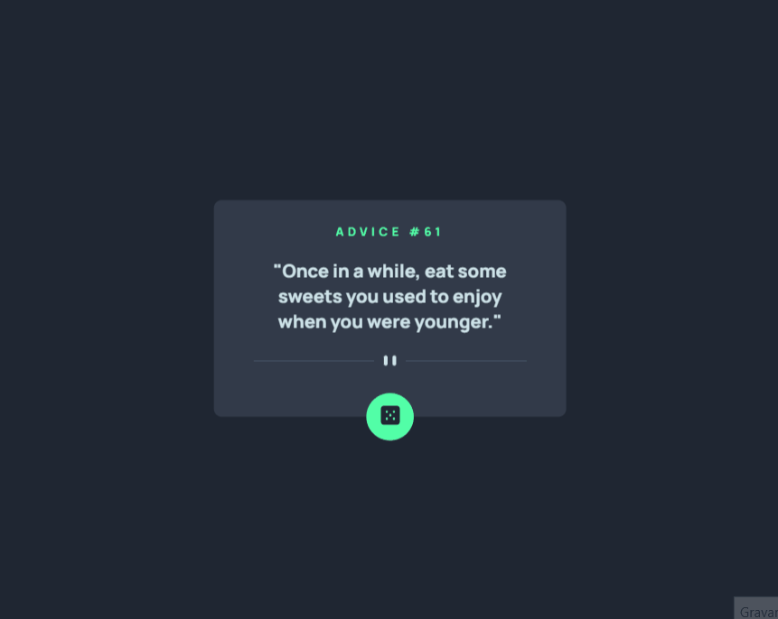

# ✨Project - Advice Generator app

## Welcome! 👋

Esta é uma solução para a o desafio Advice Generator app do Frontend Mentor. Os desafios do Frontend Mentor ajudam você a melhorar suas habilidades de codificação criando projetos realistas.

## Challenges 🚀

- O objetivo principal foi a criação de um Gerador de Conselhos baseado em seu design de orientação, seria uma página consumindo API ✅

- A página tem por finalidade a apresentação de conselhos aletórios ✅

- Este desafio usa a API Advice Slip ✅

- Os usuários devem ser capazes de: 
    - Exibir o layout ideal para a página
    
    - Ver os estados de foco para todos os elementos interativos na página

    - Clicar no botão e gerar um evento

- Criado com JavaScript, HTML e CSS ✅

## My process 🚀

- Semantic HTML5 markup 👩‍💻

- Utilização de API 👩‍💻

- Posicionamento de elementos no CSS 👩‍💻

- JavaScript 👩‍💻

## Author

- Frontend Mentor - [@andressa-l](https://www.frontendmentor.io/profile/andressa-l)
